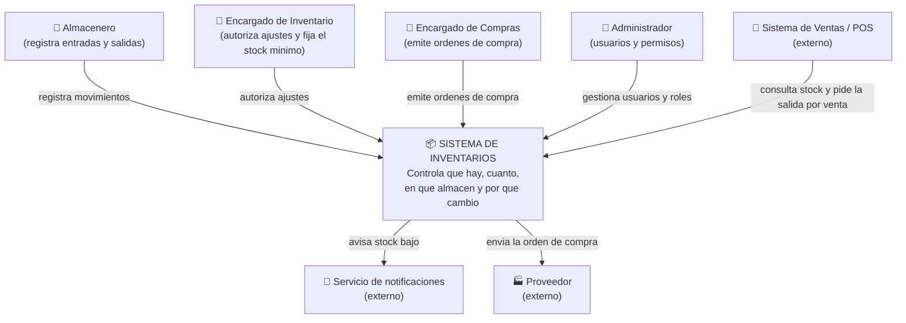
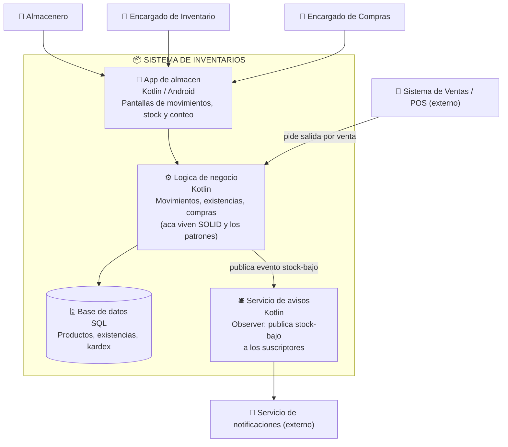

# C4 — Sistema de Inventarios

**Estudiante:** Vladimir Condori Huanca
**Variante:** Sistema de Inventarios

---

## Nivel 1 — Contexto

¿Quién usa el sistema y con qué otros sistemas habla?

---

## Nivel 2 — Contenedores

¿De que piezas ejecutables y almacenes esta hecho el sistema?

