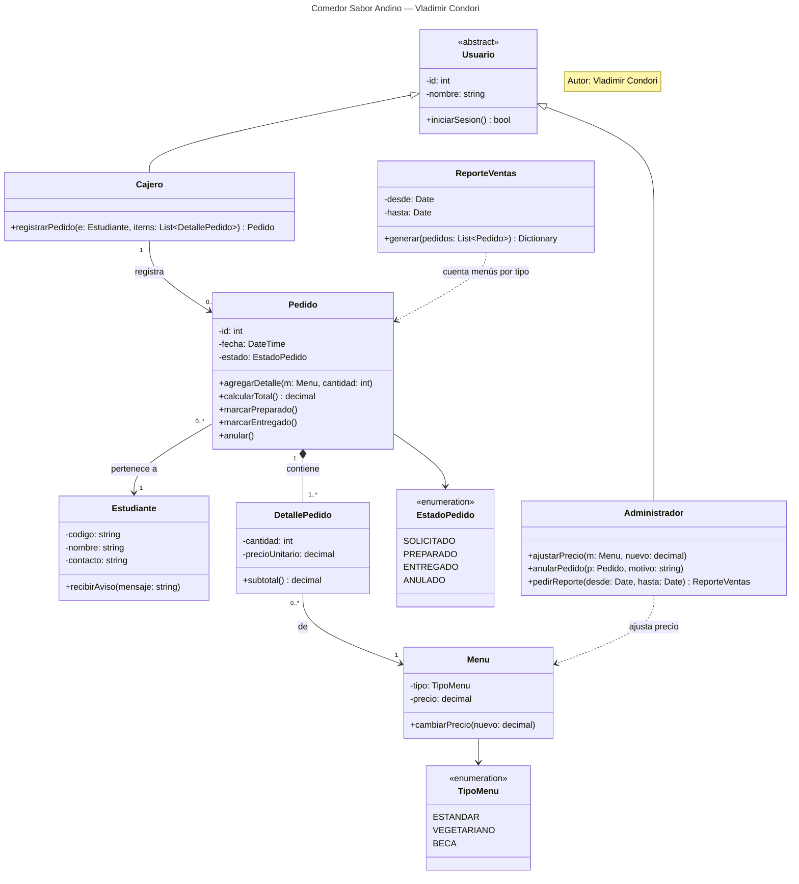

# Parte 1 — Diagrama de clases

Autor: Vladimir Condori
Caso: Comedor Universitario "Sabor Andino" (Variante A)

```mermaid
---
title: Comedor Sabor Andino — Vladimir Condori
---
classDiagram
    note "Autor: Vladimir Condori"

    class Usuario {
        <<abstract>>
        -id: int
        -nombre: string
        +iniciarSesion() bool
    }
    class Cajero {
        +registrarPedido(e: Estudiante, items: List~DetallePedido~) Pedido
    }
    class Administrador {
        +ajustarPrecio(m: Menu, nuevo: decimal)
        +anularPedido(p: Pedido, motivo: string)
        +pedirReporte(desde: Date, hasta: Date) ReporteVentas
    }
    class Estudiante {
        -codigo: string
        -nombre: string
        -contacto: string
        +recibirAviso(mensaje: string)
    }
    class Pedido {
        -id: int
        -fecha: DateTime
        -estado: EstadoPedido
        +agregarDetalle(m: Menu, cantidad: int)
        +calcularTotal() decimal
        +marcarPreparado()
        +marcarEntregado()
        +anular()
    }
    class DetallePedido {
        -cantidad: int
        -precioUnitario: decimal
        +subtotal() decimal
    }
    class Menu {
        -tipo: TipoMenu
        -precio: decimal
        +cambiarPrecio(nuevo: decimal)
    }
    class TipoMenu {
        <<enumeration>>
        ESTANDAR
        VEGETARIANO
        BECA
    }
    class EstadoPedido {
        <<enumeration>>
        SOLICITADO
        PREPARADO
        ENTREGADO
        ANULADO
    }
    class ReporteVentas {
        -desde: Date
        -hasta: Date
        +generar(pedidos: List~Pedido~) Dictionary
    }

    Usuario <|-- Cajero
    Usuario <|-- Administrador
    Pedido "0..*" --> "1" Estudiante : pertenece a
    Cajero "1" --> "0..*" Pedido : registra
    Pedido "1" *-- "1..*" DetallePedido : contiene
    DetallePedido "0..*" --> "1" Menu : de
    Menu --> TipoMenu
    Pedido --> EstadoPedido
    Administrador ..> Menu : ajusta precio
    ReporteVentas ..> Pedido : cuenta menús por tipo
```
