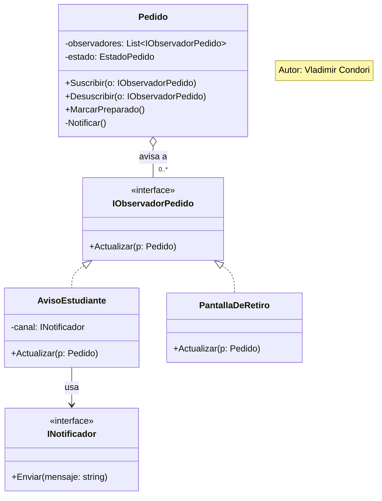

# Parte 3 — El patrón

Autor: Vladimir Condori

## Requerimiento
"Cuando un pedido queda preparado, el estudiante debe recibir un aviso."

## Patrón aplicado: Observer
Es un evento (el pedido pasa a PREPARADO) al que deben reaccionar uno o más interesados, sin que el pedido sepa quiénes son.

## Diseño

